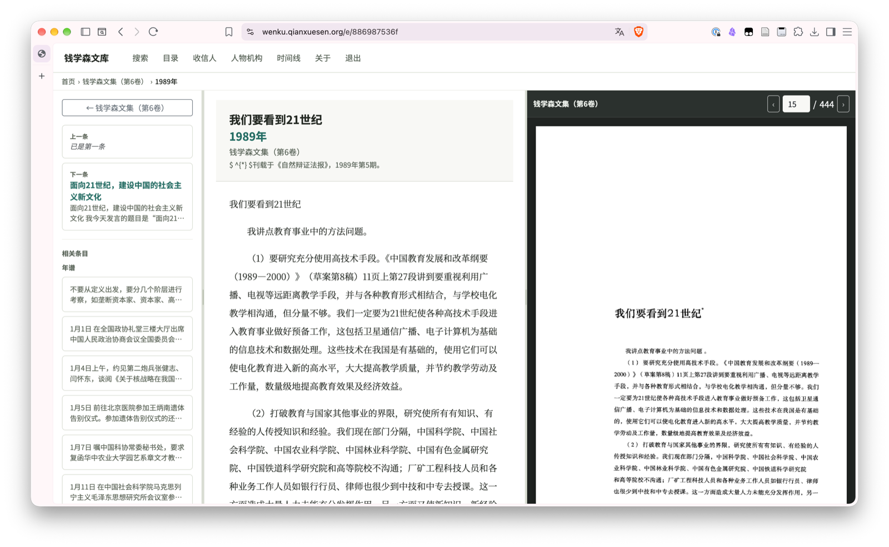

<div align="center">

# qian-wenku-web

**钱学森文库 · The Qian Xuesen Digital Archive**

A read-only web application for exploring archival materials pertaining to the Chinese-born scientist Qian Xuesen 钱学森 (Hsue-shen Tsien, 1911–2009). The `qian-wenku-web` application supports three entry formats: chronicles (_nianpu_), essays in collected works (_wenji_), and correspondences (_shuxin_). 

[](LICENSE)
[](pyproject.toml)

[🌐 Live site](https://wenku.qianxuesen.org/) ·
[📬 Request access](https://wenku.qianxuesen.org/request-access)

</div>



## ✨ Features

- 🔍 **Full-text search** across the entire corpus
- 📖 **Side-by-side reading** — digital transcript next to the scanned original page
- 🗂️ **Structured browsing** by source, year, recipient, and people/organizations
- 🔒 **Strictly read-only** — the corpus cannot be modified through the app
- 🚀 **Simple to run** — one Flask app, one SQLite file, no build step

## 📬 Access

Request an individual non-expiring access code at <https://wenku.qianxuesen.org/request-access>.

## ⚖️ Licensing

The **code** in this repository is MIT-licensed. The **corpus data** (texts, scans, and databases) is prepared by the separate private [`qian-wenku-ingest`](https://github.com/tianyuf/qian-wenku-ingest) pipeline, is separately licensed, and is not stored here.

---

## 🛠️ Developers

Technical documentation for working on the codebase.

### Architecture

The app is Flask + SQLite, server-rendered, with HTMX for in-place search results. There is no JavaScript or CSS build step. It is strictly read-only: the database is opened with `mode=ro` and `PRAGMA query_only=ON`, and the codebase contains no import, migration, schema-creation, or ingestion code.

### Setup

```bash
python -m venv .venv
. .venv/bin/activate
python -m pip install -e '.[dev]'
pytest
python tests/create_fixture.py artifacts    # tiny synthetic corpus for local use
flask --app qian_wenku_web.wsgi run
```

### Data format

The web process consumes a single prepared "artifact directory" containing exactly:

```text
artifacts/
├── corpus.db          # corpus database, schema version 1
├── manifest.json      # record counts + sha256 checksums
└── page_images.json   # page → 10-char hex image ID (served from CDN)
```

- `corpus.db` — schema version `1` (via both `PRAGMA user_version` and the `schema_info` table), non-empty `sources` and `entries`, and a populated permalink for every entry. Full details: `qian_wenku_web.artifacts`.
- `manifest.json` — schema version `1` with generated-at timestamp, record counts, and sha256/byte-size checksums for the other two files.
- `page_images.json` — maps source IDs and page numbers to 10-character lowercase hex page-image IDs generated from truncated SHA-256 digests. Images themselves live on the CDN configured by `R2_CDN_BASE` / `R2_PREFIX`.

Validate an artifact before starting the service:

```bash
qian-wenku-preflight --artifact-dir /path/to/artifacts
```

### Configuration

All configuration is via environment variables (not loaded from `.env` files by the package itself); see `.env.example`:

| Variable | Purpose |
|---|---|
| `WENKU_ARTIFACT_DIR` | Path to the artifact directory |
| `R2_CDN_BASE` / `R2_PREFIX` | Where page scans are served from |
| `BETA_PASSPHRASE` | Optional operator fallback credential; access control is also enabled when `ACCESS_DATABASE_PATH` is set |
| `SECRET_KEY` / `SESSION_COOKIE_SECURE` | Session signing key and secure-cookie switch; required when access control is enabled |
| `ACCESS_DATABASE_PATH` / `ACCESS_CODE_SECRET` | Writable grant database and secret used to hash individual access codes |
| `ACCESS_HOURLY_LIMIT` | Global access-code issuance ceiling |
| `ACCESS_TERMS_VERSION` | Accepted archive-use terms version stored with each grant |
| `RESEND_API_KEY` / `ACCESS_FROM_EMAIL` | Resend credentials for automatic code delivery; keep the API key out of source control |
| `TURNSTILE_SITE_KEY` / `TURNSTILE_SECRET_KEY` | Cloudflare Turnstile credentials required for the public request form |
| `PUBLIC_BASE_URL` | Public archive origin used in access-code emails |
| `WENKU_MCP_TOKEN` | Optional operator fallback token for the hosted MCP endpoint |
| `WENKU_BETA_PASSPHRASE` | Service credential used by the MCP process to call the protected web API |

### Routes

| Route | Purpose |
|---|---|
| `/`, `/search/results` | Search UI and HTMX results |
| `/login`, `/request-access` | Access-code login and automatic non-expiring grant requests |
| `/browse`, `/browse/year/<year>`, `/date/` | Corpus browsing |
| `/e/<permalink>` | Canonical entry page |
| `/browse/recipients`, `/browse/entities` | Relationship directories |
| `/api/search/`, `/api/browse/`, `/api/meta/`, `/api/pdf/` | JSON APIs |
| `/health` | Lightweight process and database health check |

### Deployment

Checked-in examples for the production deployment at `https://wenku.qianxuesen.org/`:

- `deploy/systemd/qian-wenku-web.service` — gunicorn service
- `deploy/nginx/wenku.qianxuesen.org.conf` — site config
- `deploy/www/` — static landing page for `https://www.qianxuesen.org/`

Install the package and virtualenv under `/opt/qian-wenku-web`, place the prepared artifact at `/opt/qian-wenku-web/artifacts`, and install only the web service and nginx site. There are no backup or ingestion units in this repository.

### MCP server (for AI agents)

A hosted MCP endpoint is exposed at `https://wenku.qianxuesen.org/mcp/rpc` for AI clients (Claude Desktop, etc.). Each individual access code works as both the website login credential and MCP bearer token. Codes are available from `https://wenku.qianxuesen.org/request-access`.

```json
{
  "mcpServers": {
    "qian-wenku": {
      "type": "http",
      "url": "https://wenku.qianxuesen.org/mcp/rpc",
      "headers": { "Authorization": "Bearer your-token" }
    }
  }
}
```

Tools exposed: `search` (substring + filters), `get_entry` (full transcript + navigation), `list_sources` (volumes with entry counts and year ranges).

For local development (stdio mode, against the fixture or a dev server), install the `mcp` extra and run `qian-wenku-mcp` directly — see the [help page](https://wenku.qianxuesen.org/mcp) on the live site.

## 🔐 Security

Please report security vulnerabilities privately to the repository maintainers rather than opening a public issue. Do not include production corpus data, credentials, private paths, or personal information in a report.

The application is designed for read-only prepared artifacts. A deployment should run the preflight check, keep the artifact and application tree non-writable by the service, terminate TLS at nginx, and avoid exposing Gunicorn directly. Data licensing and content corrections are outside the code security policy.
